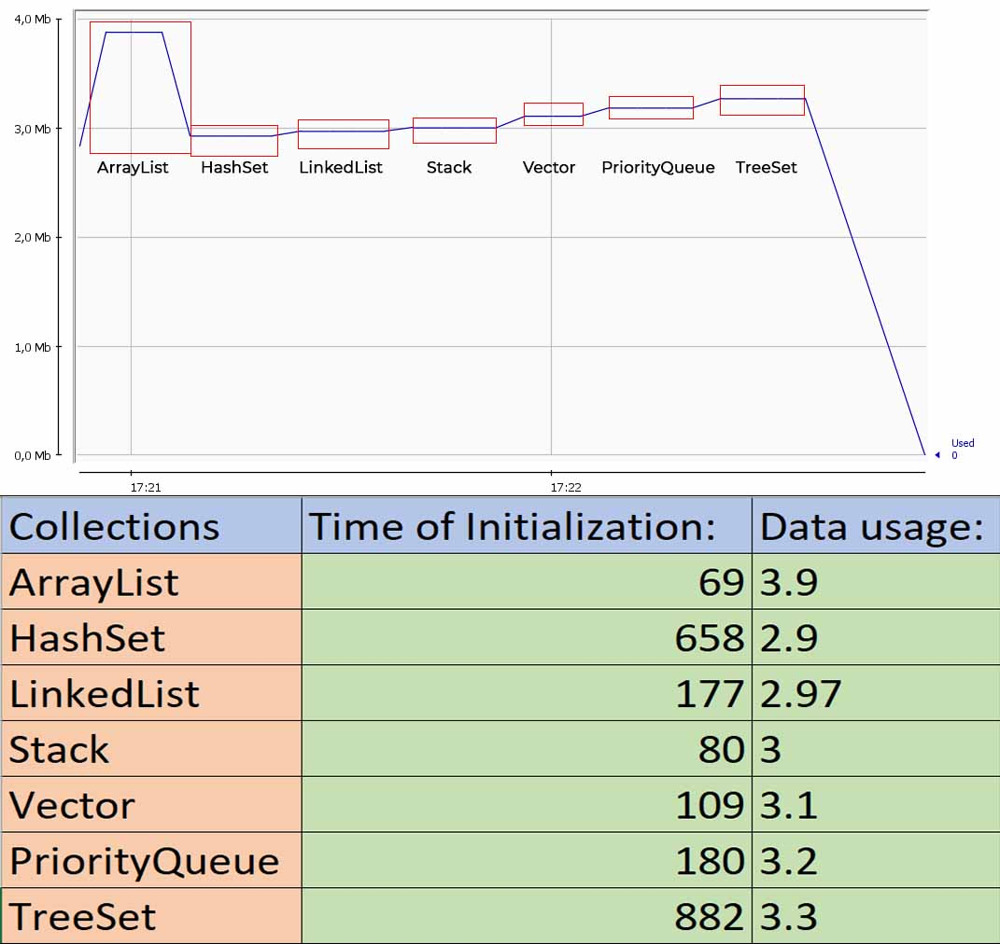

# Collections Test

Java program to test functionality of built-in collections,
initialization and some operations (add, remove ...)

Results:

## Folder Structure

The workspace contains two folders by default, where:

- `src`: the folder to maintain sources
- `lib`: the folder to maintain dependencies
